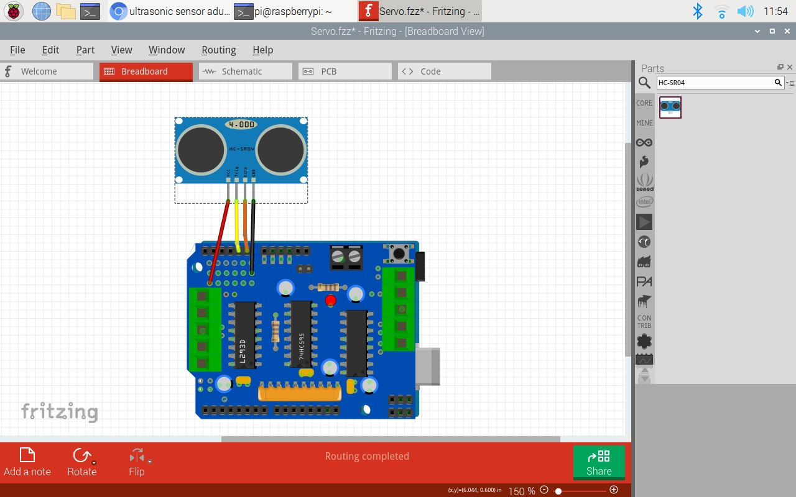

# Multi-Function Infrared-Controlled Robot

This project involves building a versatile robot capable of performing various tasks, including movement, obstacle avoidance, playing familiar melodies through a passive buzzer, and responding to infrared signals from a remote control.

## Table of Contents

- [Project Overview](#project-overview)
- [Components Needed](#components-needed)
- [Wiring Diagram](#wiring-diagram)
- [Installation](#installation)
- [Functionality](#functionality)
- [Remote Control Commands](#remote-control-commands)
- [License](#license)

## Project Overview

Imagine a robot that can navigate its environment, avoid obstacles, play popular melodies using a passive buzzer, and execute commands received via infrared signals from a remote control. This project combines hardware components such as DC motors, ultrasonic sensors, a servo motor, and a motor driver to create a multi-function robot.

## Components Needed

To build this project, you will require the following components:

- Arduino Uno board
- Breadboard
- DC motors (2)
- Wheels (2)
- Ultrasonic sensor
- Servo motor
- Passive buzzer
- Infrared (IR) receiver
- Infrared remote control
- Motor driver (L293D)
- 1kΩ resistor
- 10kΩ resistor
- NPN transistor
- Red LEDS (2)
- Yellow LED
- Switch
- Batteries
- Frame, bolts and nuts (for holding all components together)
- Jumper wires

## Wiring Diagram

Wheels diagram

Servo diagram

Ultrasonic sensor diagram

Infrared receiver diagram

Buzzer diagram

LEDs diagram

## Installation

To set up this project, follow these steps:

1. Clone this repository to your local machine or download the project files as a ZIP archive.

2. Open the Arduino IDE and load the `.ino` sketch file from the project directory.

3. Ensure you have the necessary libraries installed (if required) for your specific components.

4. Connect your Arduino board to your computer and select the correct board and port in the Arduino IDE.

5. Upload the sketch to your Arduino board.

## Functionality

- **Movement**: The robot can move forward, backward, and turn left or right using the DC motors and wheels.

- **Obstacle Avoidance**: It can avoid obstacles in its path using an ultrasonic sensor to detect the distance to the nearest objects.

- **Melody Playback**: The robot can play familiar melodies through a passive buzzer.

- **Orientation Indication**: Two LEDs on either side of the robot frame signal its direction when turning left or right.

- **Infrared Remote Control**: The robot responds to commands from an infrared remote control, allowing you to control its actions remotely.

## Remote Control Commands

### Robot Modes

- **Manual Control Mode**: In this mode, you can control the robot's movement using the following commands:

  - **Forward (+)**: Move the robot forward.
  - **Backward (-)**: Move the robot backward.
  - **Left (<<)**: Turn the robot left.
  - **Right (>>)**: Turn the robot right.

- **Autonomous Obstacle Avoidance Mode**: Press the QUIT button to activate this mode. In this mode, the robot will move forward until it encounters an obstacle. It will then scan to the right and left to find a possible route. If it doesn't find a clear path, it will reverse and turn in the opposite direction.

- **Return to Manual Control Mode (TEST)**: Press the TEST button to switch back to manual control mode, allowing you to control the robot's actions using the directional buttons.

### Melody Playback

- **Play "Twinkle Twinkle Little Star" (Button 1)**: Press button 1 to make the robot play the melody "Twinkle Twinkle Little Star."

- **Play "Für Elise" (Button 2)**: Press button 2 to make the robot play the melody "Für Elise."

- **Play Nokia Tune (Button 3)**: Press button 3 to make the robot play the iconic Nokia Tune.

- **Play "Happy Birthday" (Button 4)**: Press button 4 to make the robot play the melody "Happy Birthday."

## License

This project is licensed under the MIT License - see the [LICENSE.md](LICENSE.md) file for details.
